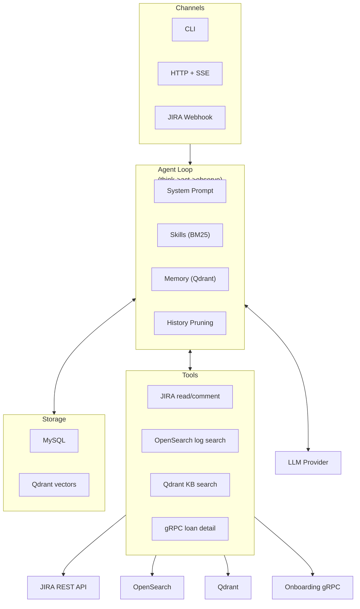
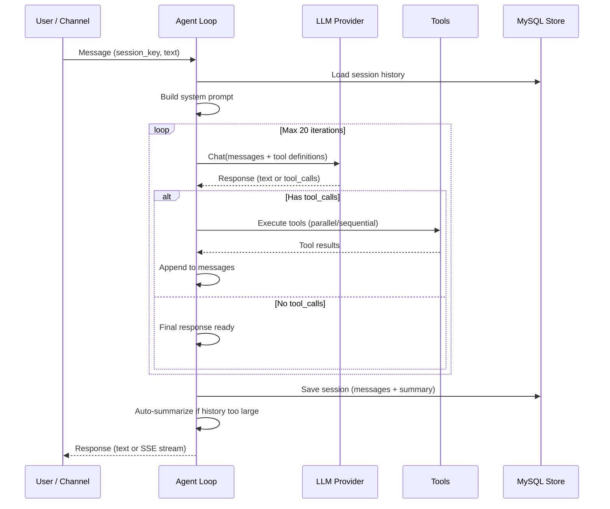

# Lending Claw

AI agent platform for Zalopay operations. A generic think-act-observe agent loop with extensible tools, DB-backed skills, and multi-channel support.

**First use case**: CS ticket resolution — investigating and responding to JIRA tickets using loan data, application logs, and knowledge base search.

## Architecture



### Agent Loop Detail



## Tech Stack

| Layer | Technology |
|-------|-----------|
| Backend | Go 1.24, Cobra CLI, `database/sql` + MySQL |
| LLM | OpenAI-compatible API (via LiteLLM) |
| Vector DB | Qdrant (knowledge base + memory embeddings) |
| External | JIRA REST, OpenSearch, Onboarding gRPC |
| Frontend | React 19, Vite 6, TypeScript, Tailwind CSS 4, shadcn/ui |
| State | Zustand (chat streaming), React Router 7 |

## Quick Start

### Prerequisites

- Go 1.24+
- MySQL 8.0+
- Node.js 20+ with pnpm (for UI)

### 1. Configure

```bash
vi config/config.yaml
```

### 2. Build & Migrate

```bash
go build -o lending-claw .
./lending-claw migrate up
```

### 3. Run

**HTTP server** (API + SSE streaming):

```bash
./lending-claw serve -v
# Listening on 0.0.0.0:8080
```

**CLI chat** (interactive):

```bash
./lending-claw chat
# or one-shot:
./lending-claw chat -m "Check ticket LENDING-123"
```

**Web UI** (development):

```bash
cd ui/web && pnpm install && pnpm dev
# http://localhost:5173 (proxies /api → localhost:8080)
```

## Project Structure

```
├── main.go                        # Entry point
├── cmd/
│   ├── root.go                    # CLI root + logging
│   ├── serve.go                   # HTTP server command
│   ├── chat.go                    # Interactive/one-shot chat
│   ├── migrate.go                 # Database migrations
│   └── wire.go                    # Dependency injection
├── internal/
│   ├── agent/
│   │   ├── loop.go                # Core think-act-observe cycle
│   │   ├── systemprompt.go        # System prompt builder
│   │   ├── history.go             # Message history + summarization
│   │   ├── pruning.go             # Context window pruning
│   │   ├── memoryflush.go         # Auto memory persistence
│   │   └── tracing.go             # Run/span recording
│   ├── tools/
│   │   ├── registry.go            # Tool registration + execution
│   │   ├── jira.go                # JIRA read/comment/get_comments
│   │   ├── knowledge.go           # Qdrant knowledge base search
│   │   ├── opensearch.go          # Log search + trace lookup
│   │   ├── loan.go                # gRPC loan detail/customer_loans
│   │   ├── skill_search.go        # BM25 skill search + read
│   │   └── memory.go              # Memory search + get
│   ├── providers/
│   │   ├── openai.go              # OpenAI-compatible LLM provider
│   │   └── retry.go               # Exponential backoff retry
│   ├── store/                     # Interface definitions
│   │   └── mysql/                 # MySQL implementations
│   ├── skills/
│   │   ├── cache.go               # In-memory skill cache
│   │   └── search.go              # BM25 search index
│   ├── memory/                    # Long-term memory (Qdrant + MySQL)
│   ├── services/                  # External clients (JIRA, OpenSearch, Qdrant, gRPC)
│   ├── http/
│   │   ├── router.go              # API routes + middleware
│   │   └── agent.go               # SSE streaming handler
│   ├── config/                    # YAML + env config loading
│   └── bootstrap/                 # Context file seeding
├── migrations/                    # MySQL migration files
├── ui/web/                        # React dashboard
│   └── src/
│       ├── pages/                 # Sessions, Skills, Context Files, Traces
│       ├── stores/chat.ts         # Zustand SSE streaming state
│       ├── lib/api.ts             # Typed API client
│       └── lib/sse.ts             # POST-based SSE parser
└── config.yaml                    # Configuration file
```

## API Endpoints

| Method | Path | Description |
|--------|------|-------------|
| `GET` | `/health` | Health check |
| `POST` | `/api/v1/agent/run` | Execute agent (supports SSE streaming) |
| `GET` | `/api/v1/sessions` | List sessions |
| `GET` | `/api/v1/sessions/{key}` | Get session with messages |
| `DELETE` | `/api/v1/sessions/{key}` | Delete session |
| `GET` | `/api/v1/skills` | List skills |
| `POST` | `/api/v1/skills` | Create skill |
| `GET` | `/api/v1/skills/{id}` | Get skill |
| `PUT` | `/api/v1/skills/{id}` | Update skill |
| `DELETE` | `/api/v1/skills/{id}` | Delete skill |
| `GET` | `/api/v1/context-files` | List context files |
| `PUT` | `/api/v1/context-files` | Create/update context file |
| `GET` | `/api/v1/traces` | List traces (paginated) |
| `GET` | `/api/v1/traces/{id}` | Get trace with spans |

### SSE Streaming

`POST /api/v1/agent/run` with `"stream": true` returns Server-Sent Events:

```
event: chunk
data: {"content": "Let me check..."}

event: tool.call
data: {"id": "tc_1", "name": "read_jira_ticket"}

event: tool.result
data: {"id": "tc_1", "is_error": false}

event: run.completed
data: {"content": "The ticket LENDING-123 is..."}
```

## Tools

### Platform (always available)

| Tool | Description |
|------|-------------|
| `skill_search` | BM25 search over DB-backed skills |
| `read_skill` | Read full skill content by name |
| `memory_search` | Semantic search over long-term memory |
| `memory_get` | Get specific memory document |

### Domain (CS use case)

| Tool | Source | Description |
|------|--------|-------------|
| `read_jira_ticket` | JIRA REST | Get ticket details |
| `comment_jira` | JIRA REST | Post JIRA wiki comment |
| `get_jira_comments` | JIRA REST | Get ticket comments |
| `search_knowledge` | Qdrant | Search knowledge base |
| `search_http_errors` | OpenSearch | Search application logs |
| `get_logs_by_trace_id` | OpenSearch | Trace request across services |
| `get_loan_detail` | gRPC | Get loan application status |
| `get_customer_loans` | gRPC | List customer loans by Zalo ID |

## Skills System

Skills are stored in MySQL and define agent behavior. The agent loop injects them into the system prompt in two modes:

- **Inline mode** (<=20 skills): Skills are embedded as XML in the system prompt. The LLM sees them directly.
- **Search mode** (>20 skills): The system prompt instructs the LLM to call `skill_search` → `read_skill` to find and load relevant skills on demand.

Skills are managed via the `/api/v1/skills` CRUD API or the web UI.

## Configuration

YAML config with environment variable overrides (`LENDING_CLAW_<SECTION>_<KEY>`):

```yaml
server:
  host: "0.0.0.0"
  port: 8080
  token: ""                          # bearer auth (optional)

llm:
  provider: "litellm"
  model: "gemini/gemini-3.1-pro-preview"
  base_url: "https://litellm.example.com/v1"
  api_key: ""                        

agent:
  max_iterations: 20
  context_window: 200000

mysql:
  dsn: ""                            

jira:
  url: "https://jira.example.com"
  personal_token: ""                 

opensearch:
  host: ""
  port: 9200
  user: ""
  password: ""                       

qdrant:
  host: ""
  port: 443
  api_key: ""                        

embedding:
  base_url: ""
  model: "qwen3-embedding-0.6b"
  vector_size: 1024

skills:
  cache_refresh_interval: 5m
```

## Development

```bash
# Build
go build -o lending-claw .

# Web UI dev
cd ui/web && pnpm dev

# Production UI build
cd ui/web && pnpm build
```
