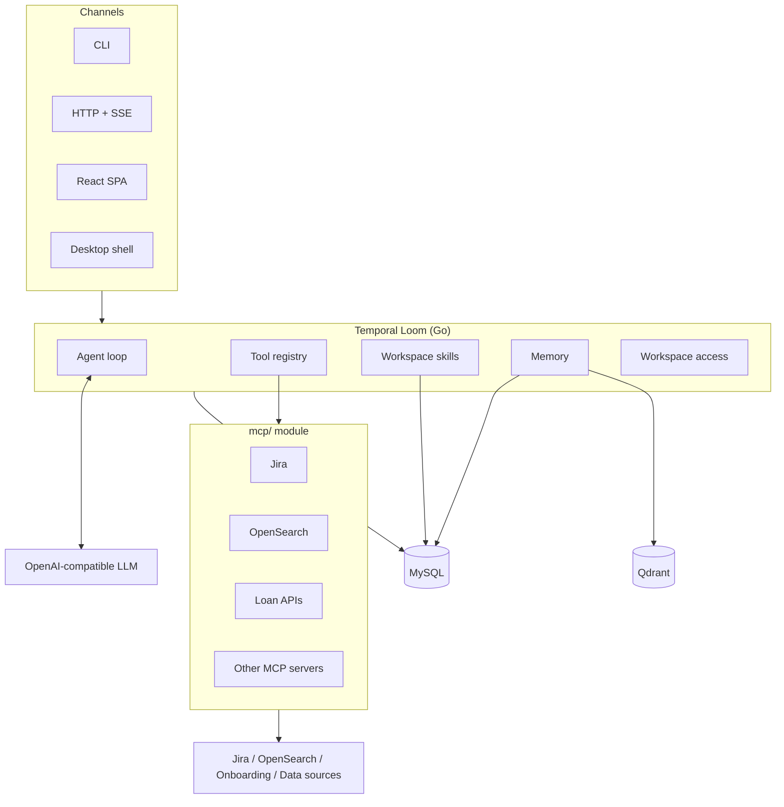

# Temporal Loom

Temporal Loom helps teams build focused AI agent workspaces around real
operational workflows. Each workspace can bring its own knowledge, tools,
settings, permissions, routines, skills, and answer-ready chat experience.

The first configured workspace is **Lending Claw**, a Cashloan CS workspace for
investigating loan applications, partner callbacks, onboarding evidence, report
data, and customer-service tickets.

> Full documentation lives in [`docs/`](docs/): architecture, codebase summary,
> code standards, deployment, design guidelines, and roadmap.

## What Temporal Loom Provides

Temporal Loom is more than a chat surface. It gives every workspace the product
controls needed to keep answers grounded in team context and connected systems.

| Feature               | What it does                                                                                                                     |
| --------------------- | -------------------------------------------------------------------------------------------------------------------------------- |
| Routines              | Turns repeated team questions into scheduled agent runs with timing, status, and execution history.                              |
| Built-in skills       | Stores reusable `SKILL.md` bundles and lets teams generate new skills from workflows with AI.                                    |
| Knowledge bases       | Indexes Confluence or Markdown sources into Qdrant so agents retrieve approved workspace context before answering.               |
| Appearance and access | Gives admins workspace-level theme, accent color, and tab-level access controls.                                                 |
| MCP servers           | Connects authenticated Model Context Protocol servers for internal APIs, documents, tickets, mail, search, and evidence sources. |
| Chat sessions         | Keeps chat history scoped to the workspace so investigations, reports, and handoffs stay traceable.                              |

## Lending Claw Workspace

Lending Claw is a Temporal Loom workspace configured for Cashloan CS. It turns
loan IDs, partner callbacks, logs, and onboarding evidence into investigation
cards and grounded answers.

Primary Lending Claw workflows:

- **Check a loan application**: read onboarding status, partner, amount,
  contract IDs, and the failing step from one prompt.
- **Pinpoint partner errors**: connect callbacks and internal functions so the
  team can see where a flow broke.
- **Compare partner performance**: produce chart-backed readouts for loan count,
  disbursement amount, and ticket-size differences.
- **Understand onboarding drop-off**: review the funnel from app open to
  approval, contract signing, and final disbursement.

## Workspace Use Cases

The same workspace model can be adapted beyond Lending Claw:

- **Customer Services**: summarize customer context, classify issues, and draft
  the next response from workspace knowledge.
- **Query Report Data**: ask questions over report data and get chart-backed
  readouts for review.
- **Marketing**: turn campaign notes, audience signals, and competitor context
  into usable briefs.
- **Planner**: build milestones, owners, dependencies, and decision notes.
- **Report readout**: explain metric movement and prepare review summaries.
- **Data cleanup**: find mismatched values, duplicates, and records that need
  follow-up.
- **Evidence summary**: turn logs, files, and tool output into a readable
  timeline.
- **Customer reply**: draft concise updates from the resolved investigation.
- **Source compare**: highlight agreement and gaps across internal systems.
- **Status report**: package progress, blockers, and owner actions.

## Architecture



The backend runs a bounded think-act-observe loop: it calls an
OpenAI-compatible LLM, executes in-process platform tools or remote MCP tools,
observes the result, and repeats until it produces a final answer. Workspace
knowledge and long-term memory are backed by MySQL and Qdrant. Domain tools are
exposed through the separate `mcp/` module.

## Tech Stack

| Layer          | Technology                                                      |
| -------------- | --------------------------------------------------------------- |
| Backend        | Go 1.25, Cobra CLI, `database/sql`, MySQL 8                     |
| LLM            | OpenAI-compatible API                                           |
| Vector DB      | Qdrant                                                          |
| Auth           | HMAC JWT, Casbin RBAC by workspace                              |
| External tools | Jira REST, OpenSearch, Onboarding gRPC, Confluence, MCP servers |
| Frontend       | React 19, Vite 7, TypeScript, Tailwind v4, Vercel AI SDK        |
| Desktop        | Zig `zero-native` WebView shell                                 |
| Observability  | OpenTelemetry, slog                                             |

## Repository Layout

```
cmd/         CLI commands and manual DI
internal/    agent, tools, providers, store, skills, memory, mcp,
             services, transport, config, bootstrap
pkg/         crypto, httputil, rbac, telemetry
migrations/  MySQL migrations
config/      YAML config
ui/          web React app and Zig desktop shell
mcp/         remote MCP server module
docs/        project documentation
```

## Quick Start

### Prerequisites

- Go 1.25+
- Node.js 22+ with pnpm
- MySQL 8.0+
- Qdrant
- `GOPRIVATE=gitlab.zalopay.vn` for internal modules

### 1. Start local infrastructure

```bash
docker compose up -d
```

### 2. Configure the app

```bash
vi config/config.yaml
```

Set the local LLM, MySQL, Qdrant, server, and integration values needed by your
workspace.

### 3. Run the backend

```bash
go build -o lending-claw .
./lending-claw serve -v
```

The HTTP API runs at `http://localhost:8080`.

### 4. Run the web UI

```bash
cd ui/web
pnpm install
pnpm dev
```

The development UI runs at `http://localhost:5173` and proxies `/api` to the
backend.

### 5. Run the desktop shell

```bash
ui/run_dev.sh
```

## API Surface

Workspace-scoped routes are under `/api/v1/workspaces/{wsID}`.

| Method                | Path                  | Description                                               |
| --------------------- | --------------------- | --------------------------------------------------------- |
| `GET`                 | `/health`             | Health check                                              |
| `POST`                | `/api/v1/set-token`   | Set auth cookie                                           |
| `POST`                | `{ws}/agent/run`      | Execute an agent run, with SSE support when `stream:true` |
| `GET`                 | `{ws}/sessions`       | List chat sessions                                        |
| `GET/DELETE`          | `{ws}/sessions/{key}` | Get or delete a chat session                              |
| `GET/POST`            | `{ws}/skills`         | List or create workspace skills                           |
| `GET/PUT/DELETE`      | `{ws}/skills/{id}`    | Manage a skill                                            |
| `GET/POST/PUT/DELETE` | `{ws}/context-files`  | Manage context files                                      |
| `GET/POST`            | `{ws}/knowledge`      | Manage knowledge bases and syncs                          |
| `GET/POST`            | `{ws}/mcp/servers`    | Manage MCP servers, refreshes, and function toggles       |
| `GET/POST`            | `{ws}/rbac/roles`     | Manage roles and members                                  |
| `GET`                 | `{ws}/rbac/me`        | Inspect current workspace access                          |
| `GET`                 | `{ws}/traces`         | List traces                                               |
| `GET`                 | `{ws}/traces/{id}`    | Inspect trace spans                                       |

## Documentation

- [`docs/architecture.md`](docs/architecture.md) - system architecture
- [`docs/agent-loop.md`](docs/agent-loop.md) - agent execution loop
- [`docs/context-management.md`](docs/context-management.md) - context handling
- [`docs/memory.md`](docs/memory.md) - memory model
- [`docs/rbac.md`](docs/rbac.md) - workspace access control
- [`docs/skills.md`](docs/skills.md) - workspace skills
- [`docs/tools.md`](docs/tools.md) - tool registry and tool execution
- [`docs/design.md`](docs/design.md) - product and UI design notes
