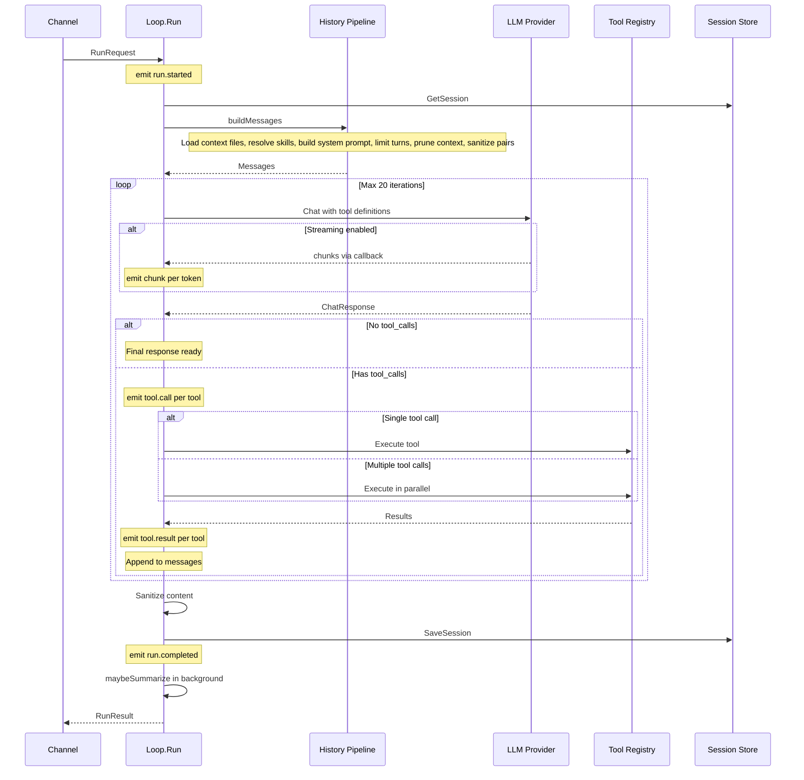
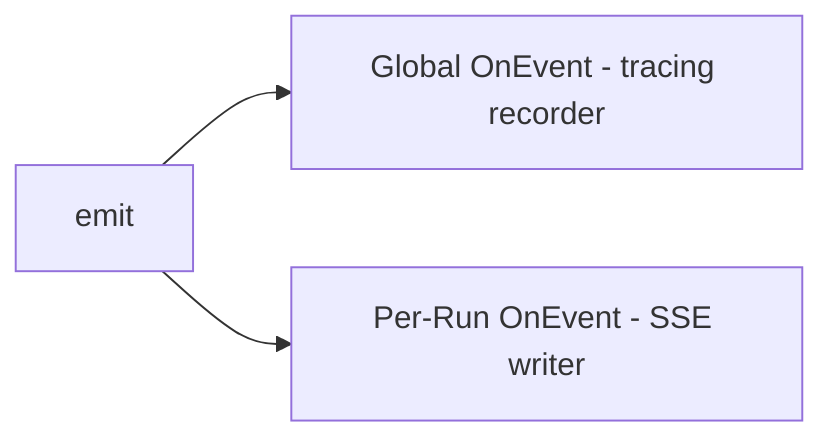
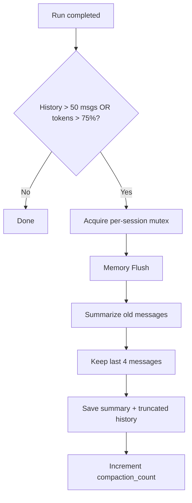

# Agent Loop

The agent loop (`internal/agent/loop.go`) implements a **single generic think-act-observe cycle**. It is the only execution path — all channels (CLI, HTTP, webhooks) feed into it.

## Lifecycle



## Configuration

```go
type LoopConfig struct {
    ID              string             // Agent identifier
    Provider        providers.Provider // LLM provider
    Model           string             // Model name
    ContextWindow   int                // Token limit (default: 200,000)
    MaxIterations   int                // Max think-act-observe cycles (default: 20)
    MaxMessageChars int                // Input message truncation (default: 32,000)
    Sessions        store.SessionStore
    ContextFiles    store.ContextFileStore
    Tools           *tools.Registry
    SkillsCache     *skills.Cache
    HasMemory       bool
    PruningCfg      *PruningConfig
    OnEvent         func(AgentEvent)   // Global event handler
}
```

## Event System

Events are emitted throughout the loop for SSE streaming and tracing:



| Event | When | Payload |
|-------|------|---------|
| `run.started` | Run begins | `session_key`, `channel`, `user_id`, `input_preview` |
| `chunk` | Each streamed token | `content` |
| `tool.call` | Before tool execution | `name`, `id` |
| `tool.result` | After tool execution | `name`, `id`, `is_error` |
| `run.completed` | Run finishes | `content`, `output_preview`, token counts |
| `run.failed` | Run errors | `error` |

## Auto-Summarization

After each run, the loop checks if summarization is needed:


