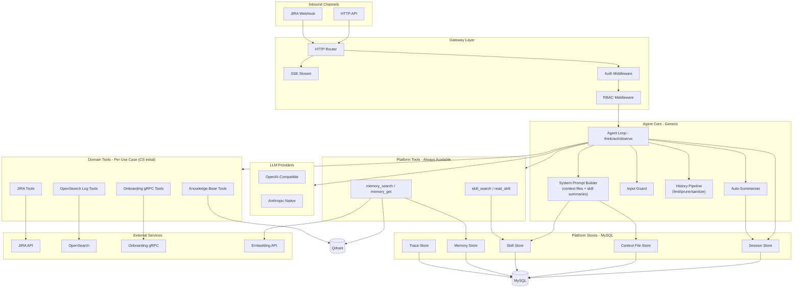
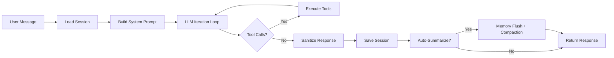

# Overview Architecture

Lending Claw is a **domain-agnostic AI agent platform** built on a single think-act-observe loop. Agent behavior is driven by **skills** and **context files** stored in MySQL — not hardcoded workflows. The same loop serves all use cases; only the skills and available tools change.

## Key Design Principles

| Principle | Implementation |
|-----------|---------------|
| **Domain-agnostic core** | Agent loop has no domain logic. Behavior comes from skills + tools. |
| **Interface-first stores** | All stores defined as interfaces in `internal/store/`, implemented in `internal/store/mysql/`. |
| **Extensible tools** | Tools implement a simple interface and register at startup. Adding a tool = implement interface + register. |
| **DB-backed skills** | Skills are CRUD-managed in MySQL. No code changes to add/modify agent behavior. |
| **Observable** | Every run produces traces and spans for debugging and monitoring. |
| **Resilient** | Memory falls back to MySQL keyword search if Qdrant is unavailable. |

## Data Flow

