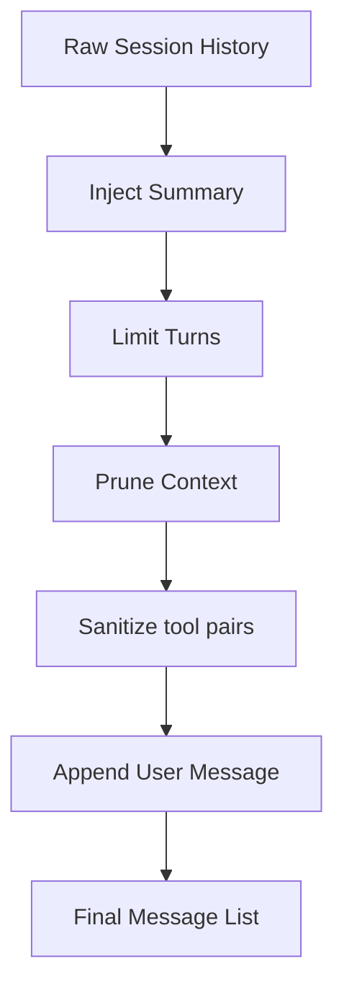
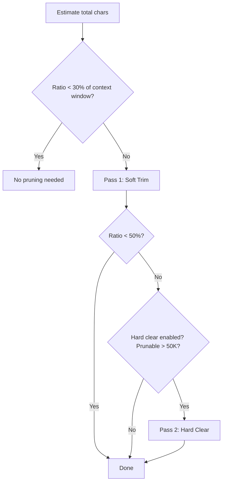

# Context Management

Context management ensures the LLM receives the right information within its token budget. Three subsystems cooperate: **system prompt building**, **history pipeline**, and **context pruning**.

## System Prompt Structure

Built by `internal/agent/systemprompt.go`:

```
┌─────────────────────────────────┐
│ 1. Identity                     │  "You are an AI agent for ZaloPay lending..."
├─────────────────────────────────┤
│ 2. Tooling                      │  List of available tool names
├─────────────────────────────────┤
│ 3. Safety                       │  No independent goals, override safety, etc.
├─────────────────────────────────┤
│ 4. Skills                       │  Inline XML or skill_search instructions
├─────────────────────────────────┤
│ 5. Memory                       │  "Run memory_search before answering..."
├─────────────────────────────────┤
│ 6. Extra Prompt                 │  Channel-specific or per-request injections
├─────────────────────────────────┤
│ 7. Context Files                │  Global + user-scoped files from MySQL
├─────────────────────────────────┤
│ 8. Runtime                      │  Current timestamp, channel info
└─────────────────────────────────┘
```

## History Pipeline

Built by `internal/agent/history.go`. Applied sequentially before each LLM call:



**1. Inject Summary**: If a conversation summary exists from prior compaction, inject it as a system message after the system prompt.

**2. Limit Turns**: If `HistoryLimit > 0`, count backward from the end and keep only the last N user turns (and their corresponding assistant/tool messages).

**3. Prune Context**: Two-pass pruning to fit within the context window.

**4. Sanitize**: Repair broken tool call/result pairs — drop orphaned tool messages, synthesize missing results.

**5. Append User Message**: Add the current user input.

## Context Pruning

Implemented in `internal/agent/pruning.go`. A two-pass strategy that compresses old tool results to fit the context window:



**Soft Trim**: For tool results older than the last 3 assistant messages, if a result exceeds 4,000 chars: keep first 1,500 chars + last 1,500 chars, replace middle with `[Tool result trimmed...]`.

**Hard Clear**: If still over budget, replace entire old tool results with `[Old tool result content cleared]`.

### Pruning Config

| Parameter | Default | Description |
|-----------|---------|-------------|
| `KeepLastAssistants` | 3 | Protect last N assistant messages from pruning |
| `SoftTrimRatio` | 0.3 | Start soft trim when context > 30% of window |
| `HardClearRatio` | 0.5 | Start hard clear when context > 50% of window |
| `SoftTrimMaxChars` | 4,000 | Only soft-trim tool results larger than this |
| `SoftTrimHeadChars` | 1,500 | Characters to keep from start of tool result |
| `SoftTrimTailChars` | 1,500 | Characters to keep from end of tool result |
| `MinPrunableToolChars` | 50,000 | Only hard-clear if total prunable chars exceed this |
| `HardClearPlaceholder` | `[Old tool result content cleared]` | Replacement text |
