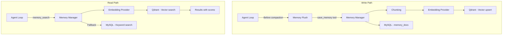

# Memory

The memory system provides **long-term persistent knowledge** that survives session summarization. While session history is compacted to fit the context window, important facts are preserved in memory for future retrieval.

## Architecture



## Components

### Memory Manager (`internal/memory/manager.go`)

Orchestrates indexing and search. Configuration:

| Config | Default | Description |
|--------|---------|-------------|
| `QdrantHost` | - | Qdrant server host |
| `QdrantPort` | 6333 | Qdrant server port |
| `QdrantTLS` | auto (port 443) | Enable TLS |
| `CollectionName` | `lending_memory` | Qdrant collection name |
| `VectorSize` | 1024 | Embedding dimension |
| `MaxChunkLen` | 1000 | Max characters per chunk |
| `MaxResults` | 6 | Default search result count |

**Key operations**:
- `IndexDocument()`: Chunk → Embed → Upsert to Qdrant (with doc_id, path, scope, text, line numbers)
- `Search()`: Embed query → Vector search → Return results with similarity scores
- `GetDocument()`: Read from MySQL with optional line range extraction
- `EnsureCollection()`: Idempotent Qdrant collection creation (cosine distance)

### Chunking (`internal/memory/chunking.go`)

Splits documents into embedding-sized chunks at paragraph boundaries:

```
Document (5000 chars)
    ↓ Split on "\n\n"
Paragraphs [p1, p2, p3, ..., pN]
    ↓ Accumulate until maxChunkLen
Chunks [chunk1(1000), chunk2(1000), ..., chunkM(800)]
    ↓ Each chunk has StartLine, EndLine metadata
```

Two strategies:
- `ChunkText()`: Simple paragraph-boundary chunking, flush at `maxChunkLen`
- `ChunkTextWithOverlap()`: Carries trailing paragraphs to next chunk for better semantic continuity (overlap budget: 200 chars)

### Embedding Provider (`internal/memory/embeddings.go`)

```go
type EmbeddingProvider interface {
    Name() string
    Model() string
    Embed(ctx context.Context, texts []string) ([][]float32, error)
}
```

Implements OpenAI-compatible embedding API. Batches texts in a single POST request. Default model: `qwen3-embedding-0.6b` (1024 dimensions).

## Memory Flush

`internal/agent/memoryflush.go` — a **special agent turn** that runs before session compaction. The LLM itself decides what's worth remembering:

```mermaid
sequenceDiagram
    participant Loop as Agent Loop
    participant LLM as LLM Provider
    participant Tools as Memory Tools
    participant Store as Qdrant + MySQL

    Note over Loop: History too large, compaction needed

    Loop->>Loop: Build flush context
    Loop->>LLM: Review conversation and save durable memories

    loop Max 3 iterations, temp 0.3
        LLM-->>Loop: Tool calls
        Loop->>Tools: Execute
        Tools->>Store: Index or search
        Store-->>Tools: Results
        Tools-->>Loop: Results
    end

    LLM-->>Loop: NO_REPLY or done
    Note over Loop: Proceed with compaction
```

**Key constraints**:
- 90-second timeout
- Low temperature (0.3) for focused, deterministic saving
- Max 4096 output tokens
- Max 3 tool iterations
- Only memory tools available

## Memory Tools

| Tool | Parameters | Description |
|------|-----------|-------------|
| `memory_search` | `query`, `max_results` (default 6) | Semantic vector search. Falls back to MySQL keyword matching if Qdrant unavailable. |
| `memory_get` | `path`, `from` (line), `lines` (count) | Read specific document with optional line range (1-indexed). |

**Fallback behavior**: If Qdrant is unreachable, `memory_search` lists all MySQL docs and performs substring matching on content/path. Returns results with `"fallback": true` indicator.

## Data Model

```sql
CREATE TABLE memory_docs (
    id         VARCHAR(36) PRIMARY KEY,
    scope      ENUM('global', 'user'),
    user_id    VARCHAR(255),           -- NULL for global
    path       VARCHAR(512),           -- e.g. "decisions/auth-approach.md"
    content    LONGTEXT,
    metadata   JSON,
    created_at TIMESTAMP,
    updated_at TIMESTAMP,
    UNIQUE KEY (scope, user_id, path)
);
```

Qdrant vectors store chunked text with payload:
```json
{
    "doc_id": "uuid",
    "path": "decisions/auth-approach.md",
    "scope": "global",
    "user_id": "",
    "text": "We decided to use JWT...",
    "start_line": 1,
    "end_line": 15
}
```
