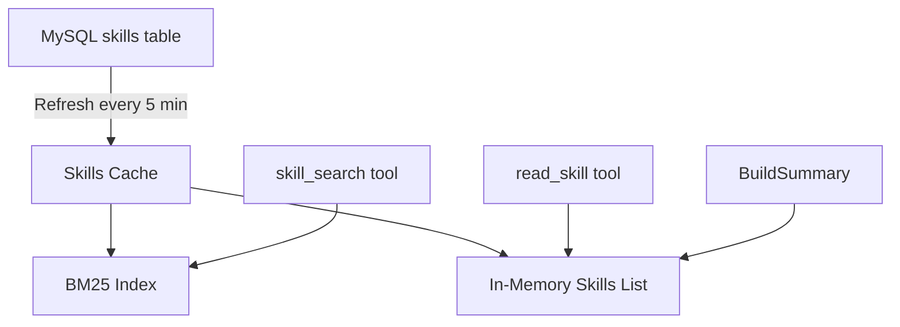
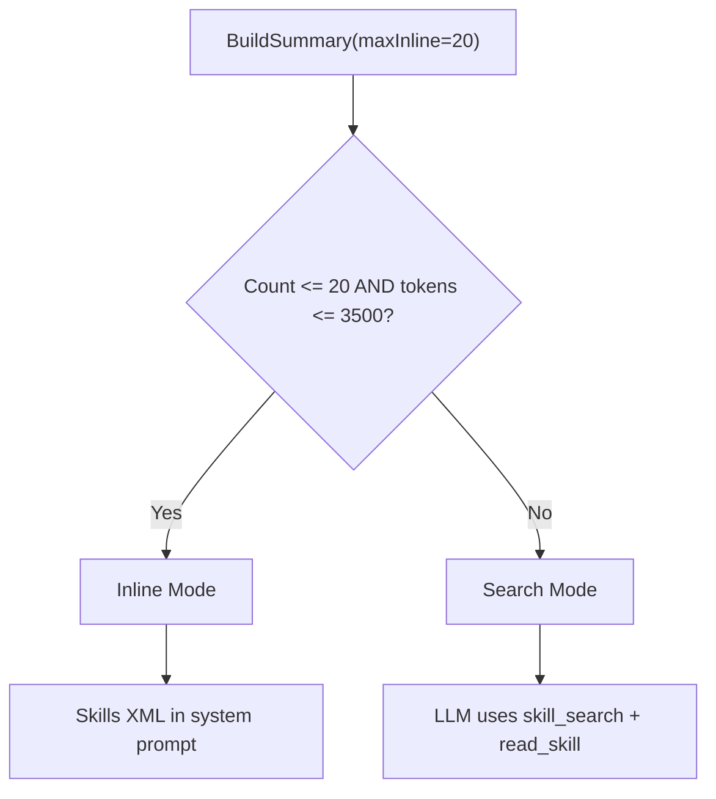
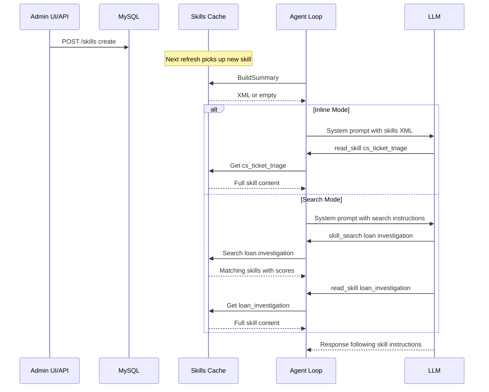

# Skills

Skills define agent behavior and are stored in MySQL. They are the primary mechanism for customizing the agent for different use cases — no code changes required.

## Data Model

```sql
CREATE TABLE skills (
    id          VARCHAR(36) PRIMARY KEY,
    name        VARCHAR(255) UNIQUE,
    description TEXT,
    content     LONGTEXT,       -- Markdown instructions
    metadata    JSON,           -- Optional tags, config
    created_at  TIMESTAMP,
    updated_at  TIMESTAMP
);
```

## Cache Architecture

`internal/skills/cache.go` maintains an in-memory cache with BM25 search:



**Refresh cycle**: On startup + every `cache_refresh_interval` (default 5 min), the cache loads all skills from MySQL and rebuilds the BM25 index. An atomic version counter tracks refreshes.

## BM25 Search

`internal/skills/search.go` implements a BM25 ranking algorithm:

```
Score(query, doc) = Σ IDF(term) × tf(term,doc) × (k1+1) / (tf + k1 × (1 - b + b × |doc|/avgdl))
```

| Parameter | Value | Description |
|-----------|-------|-------------|
| k1 | 1.2 | Term frequency saturation |
| b | 0.75 | Length normalization |

**Tokenization**: Lowercase → remove punctuation → split → filter single-char tokens. Applied to skill `name + description`.

## Two Injection Modes

The skills section in the system prompt adapts based on skill count:



**Inline Mode** (few skills): LLM sees skill names + descriptions directly. Calls `read_skill` only when it needs the full content.

**Search Mode** (many skills): LLM must call `skill_search` first, then `read_skill`. Two tool calls per skill lookup, but scales to hundreds of skills.

## Skill Lifecycle


